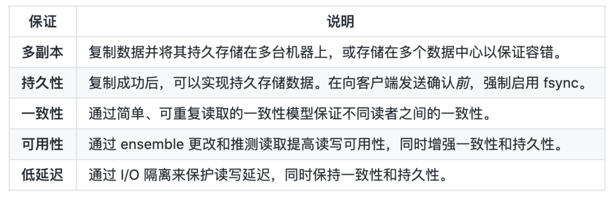
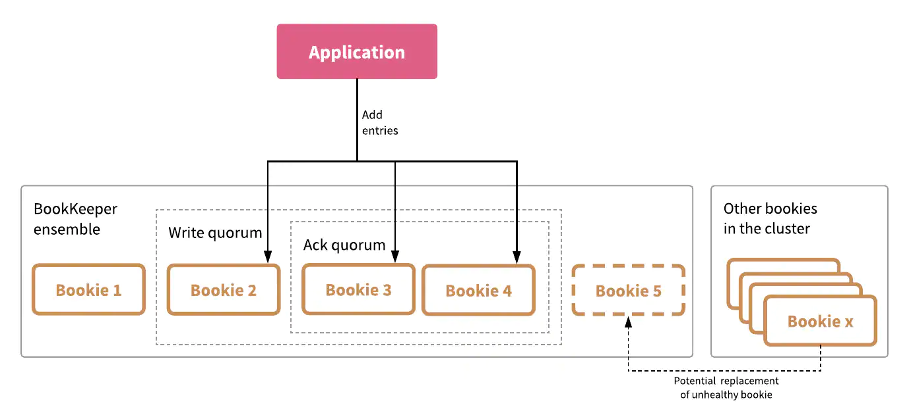
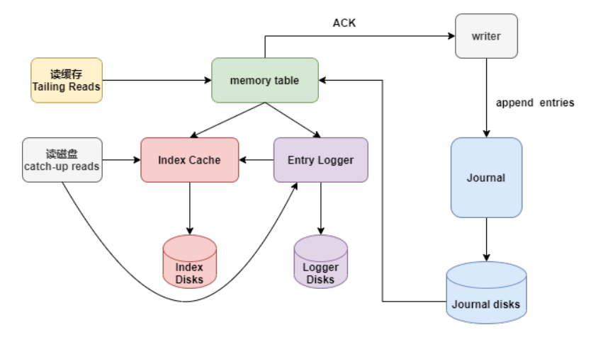
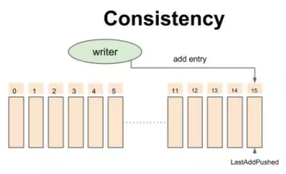
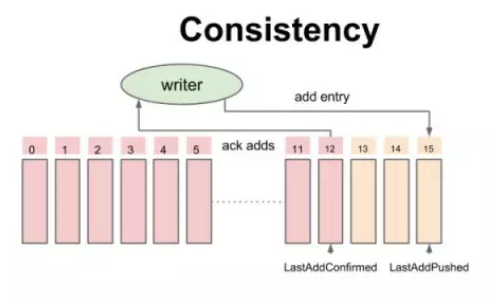
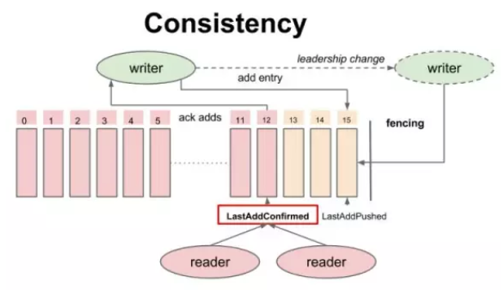
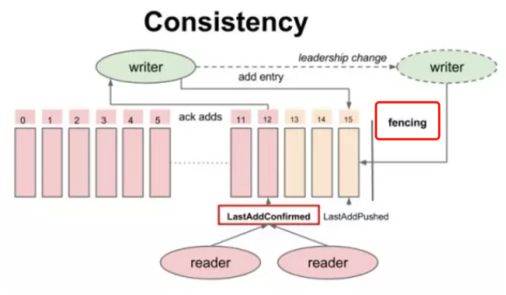
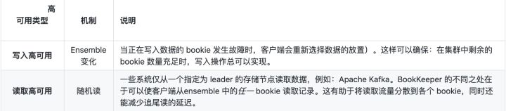
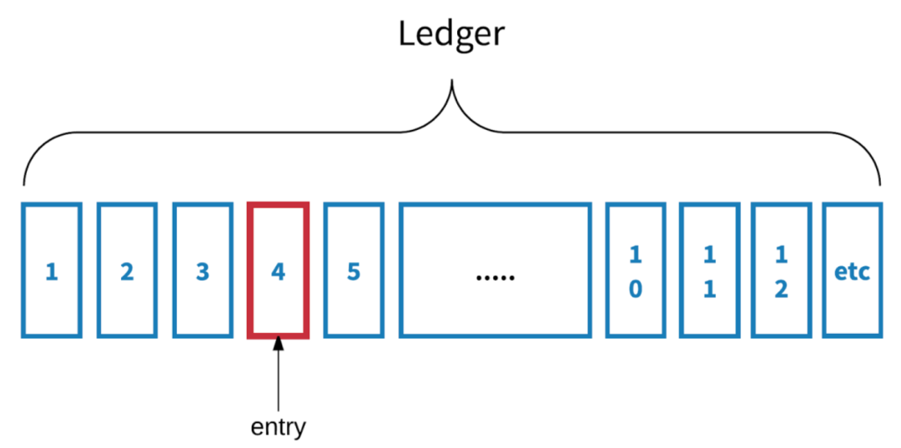

# Bookkeeper

## 零、背景

>这里引用文章：[基础向｜Apache BookKeeper 简介](https://mp.weixin.qq.com/s?__biz=MzUxOTc4NDc2MQ==&mid=2247485007&idx=1&sn=876401d189db3d48883058137f5f3518&source=41#wechat_redirect)
>
>如果大家对Bookkeeper感兴趣， 可以访问 Pulsar的PMC成员的知乎个人主页：[翟佳(StreamNative联合创始人,Pulsar PMC成员)](https://www.zhihu.com/people/apachepulsar/posts). 以下全文大部分参考作者上传的blog。

> 如果对LSM树有一定的理解，那么这篇文档理解起来会相对容易很多。

**Apache BookKeeper** <u>是企业级存储系统，旨在保证高持久性、一致性与低延迟</u>。Pulsar 由雅虎研究院（Yahoo! Research）开发，旨在实现 Hadoop 分布式文件系统（HDFS）NameNode 的高可用，在此之前，NameNode 不具备高可用特性，存在单点故障的问题。

Bookkeeper有一个非常成功的应用案例：apache pulsar，是近年雅虎开源的一个MQ，<u>pulsar相对于kafka来说，在存储上有优势，kafka的单个partition的存储容量受到了部署kafka的broker的硬盘容量限制，当有大量的数据需要MQ支持时，partition可能会遇到瓶颈而无法扩展</u>。当然可以预先增加partition的数量和broker的数量来满足MQ的存储需求，但是当消息需要存储的时候相对较长或者数据量非常多之后，比如存储一个月，需要按月做数据的回拉跑计算任务，这种场景对kafka的集群来说是有非常大的浪费的，因为我们需要的是更多的存储，不是更多了broker的能力，bookkeeper为pulsar提供了存储计算分离的架构支持，存储和pulsar的broker能分别扩展，这是kafka不具备的。

自 2011 年起，BookKeeper 开始在 Apache ZooKeeper 下作为子项目孵化，并于 2015 年 1 月作为顶级项目成功问世。<u>在这四年间，Twitter、Yahoo、Salesforce 等公司使用 BookKeeper 存储和服务重要数据，并支撑了许多不同场景。**本文将简要介绍 BookKeeper 的概念和相关术语。**</u>

## 一、Bookkeeper是什么

**BookKeeper 是一种优化实时工作负载的存储服务，具有可扩展、高容错、低延迟的特点。**

BookKeeper 的设计完全符合以上要求，并广泛用于多种用例，**例如为分布式系统提供高可用性或多副本**（如 HDFS NameNode 节点、Twitter 的 Manhattan key-value 存储）；在单个集群中或多个集群间（多个数据中心）提供跨机器复制；为发布/订阅（pub-sub）消息系统（如 Twitter 的 EventBus、Apache Pulsar）提供存储服务；为流工作存储不可变对象（例如：检查点数据的快照）等。

企业级的**实时存储平台**应符合以下几项要求：

- **即使在强持久性条件下**，以极低的延迟（小于 5 毫秒）读写 entry 流
- 能够持久、一致、容错地存储数据
- 在写数据时，能够进行流式传输或追尾传输
- 有效地存储、访问历史数据与实时数据

BookKeeper 通过提供以下保证来**同时**满足上述各项要求：

### 多副本

BookKeeper 在一个数据中心内的多个机器上，或是多个数据中心之间，复制每条数据记录并存储多个副本（通常是 3 个或 5 个副本）。

一些分布式系统使用主/从或管道复制算法在副本之间复制数据（例如，Apache HDFS、Ceph、Kafka 等），BookKeeper 的不同之处在于使用 **quorum-vote 并行复制算法**来复制数据，以确保可预测的低延迟。下图即为 BookKeeper 集成中的多副本。

Client 在创建 Ledger 的时候，从 Bookie Pool 里面按照指定的数据放置策略挑选出一定数量的 Bookie，构成一个 Ensemble；

每条 Entry 会被并行地发送给 Ensemble 里面的部分 Bookies（每条 Entry 发送多少个 Bookie 是由 Write Quorum size 设置、具体发送哪些 Bookie 是由 Round Robin 算法来计算），并且所有 Entry 的发送以流水线的方式进行，也就是意味着发送第 N + 1 条记录的写请求不需要等待发送第 N 条记录的写请求返回；

对于每条 Entry 的写操作而言，当它收到 Ensemble 里面大多数 Bookie 的确认后（这个由 Ack Quorum size 来设置），Client 认为这条记录已经持久化到这个 Ensemble 中，并且有大多数副本。

Ledger 中的数据**分布**在 bookies 的 ensemble 中。也就是说，每条记录都存有多个副本。用户可以在客户端级别配置副本数，即**写入 quorum 大小**。在上图中，写入 quorum 大小为 3，即记录写入到 bookie 2、bookie 3 与 bookie 4。

客户端向 ensemble 中写入数据记录时，需要等待直至有指定数量的副本发送确认（ack）。副本数即为 **ack quorum 大小**。接收到指定数量的 ack 后，客户端默认写入成功。在上图中，ack quorum 大小为 2，也就是说，比如 bookie 3 和 bookie 4 存储数据记录，则向客户端发送一条确认。

当 bookie 发生故障时，ensemble 的组成会发生变化。正常的 bookies 会取代终止的 bookies，这种取代可能只是暂时的。例如：如果 **Bookie 5** 终止，**Bookie x** 可能会取代它。

**BookKeeper 多副本基于以下核心理念**

1. 日志流面向记录而不是面向字节。这意味着，数据总是存储为不可分割的记录（包括元数据），而不是存储为单个字节数组。
2. 日志（流）中记录的顺序与记录副本的实际存储顺序分离。这两个核心理念确保 BookKeeper 多副本能够实现以下几项功能：
   - 为向 bookies 写入记录提供多种选择，从而确保即使集群中多个 bookies 终止或运行缓慢，写入操作仍然可以完成（只要有足够的容量来处理负载）。可以通过改变 ensemble 来实现。
   - 通过增加 ensemble 大小来最大化单个日志（流）的带宽，以使单个日志不受一台或一小组机器的限制。可以通过将 ensemble 大小配置为大于写入 quorum 大小来实现。
   - 通过调整 ack quorum 大小来改善追加时的延迟。这对于确保 BookKeeper 的低延迟十分重要，同时还可以提供一致性与持久性保证。
   - 通过多对多副本恢复提供快速**再复制**（再复制为复制不足的记录创建更多副本，例如：副本数小于写入 quorum 大小）。所有的 bookies 都可以作为记录副本的提供者*与*接受者。

单个bookie的数据流转大致如下：

### 持久性

**保证复制每条写入 BookKeeper 的数据记录，并持久化到指定数量的 bookies 中。可以通过使用磁盘 fsync 和写入确认来实现。**

- 在单个 bookie 上，将确认发送给客户端之前，数据记录已明确写入（启用 fsync）磁盘，以便在发生故障时能够持久保存数据。这样可以保证数据写入到持久化存储中不依赖电源，可以被重新读取使用。
- 在单个集群内，复制数据记录到多个 bookies，以实现容错。
- 仅当客户端收到指定数量（通过 ack quorum 大小指定）的 bookies 响应时，才 ack 数据记录。

最新的 NoSQL 类型数据库、分布式文件系统和消息系统（例如：Apache Kafka）都假定：保证最佳持久化的有效方式是将数据复制到多个节点的内存中。但问题是，这些系统允许潜在的数据丢失。BookKeeper 旨在提供更强的持久性保证，完全防止数据丢失，从而满足企业的严格要求。

### 一致性

保证一致性是分布式系统中的常见问题，尤其是在引入多副本以确保持久性和高可用时。BookKeeper 为存储在日志中的数据提供了简单而强大的一致性保证（可重复读取的一致性）：

- <u>**如果记录已被引用程序 ack，则必须立即可读。**</u>
- <u>**如果记录被读取一次，则必须*始终*可读。**</u>
- <u>**如果记录 R 成功写入，则在 R之前的所有记录都已成功提交/保存，并且将始终可读。**</u>
- <u>**在不同读者之间，存储记录的顺序必须完全相同且可重复。**</u>

这种可重复读取的一致性由 BookKeeper 中的 LastAddConfirmed（**LAC**）协议实现。下面，我们简单的描述一下其一致性模型的实现：

对于 Write 操作而言，writer 不断添加记录，每条记录会被 writer 赋予一个严格递增的Entry id，所有的追加操作是非阻塞的，也就是说：第二条记录不用等待第一条记录返回结果就可以发出。已发送到Bookie但未被ack的数据的位置指针叫做Last-Add-Pushed（LAP）。

注意这个模型是以writer为视角，Entry实际上可能会存在多个bookie上，多个bookie对应一个writer。

一致性模型-追加数据时的中间状态：

伴随着写成功的 ack，writer 不断地更新一个指针叫做 Last-Add-Confirm（LAC），所有 Entry id 小于等于 LAC 的记录保证持久化并复制到大多数副本上，而 LAC 与 LAP（Last-Add-Pushed）之间的记录就是已经发送到 Bookie 上但还未被 ack 的数据。

LAC作为Entry元数据的一部分，通过Entry保存到Bookie中，而Ledger本身并不存储LAC，这样设计的好处是：

- 不需要频繁更新ZK元数据
- 因为LAC保证了之前的entry已经持久化成功了，那么在做ledger恢复的时候，只需要从LAC后面开始处理就可以了

LAC由客户端生成，在动态插入Entry的时候，记录的是当前已经ACK成功的Entry ID。比如插入Entry5的时候，LAC是4，那么存储在bookie的Entry5中LAC是4。我们知道Ledger包含了元数据Last Entry ID，当Ledger关闭时，会更新5到Last Entry ID中。

#### 读一致性

所有的 Reader 都可以安全读取 Entry ID 小于或者等于 LAC 的记录，从而保证 reader 不会读取未确认的数据，保证了 reader 之间的一致性。

#### 写一致性

简单来说，Fencing机制用于防止有多个writer（pulsar中即为broker）同时写同一个topic/partition

什么时候会出现多个writer同时写同一个topic呢？在pulsar中，当zk检测到有一个broker1挂掉了，那么会把该broker1拥有的topic所有权转移到另一个broker2。如果broker1实际上没挂掉（类似出现脑裂的情况），那么会出现broker1、broker2同时写同一个topic，对于broker1写入完成的数据，由于topic已经给broker2接管了，在broker2看来并不知道broker1写入了数据，就会出现写入数据的不一致。
那么bookkeeper是如果解决这个问题呢？它引入了Fencing机制，工作机制如下：

1. 假设Topic X当前拥有者Broker1（B1）不可用（通过zk判断）
2. 其它broker（B2）将TopicX当前Ledger状态从OPEN修改为IN_RECOVERY
3. B2向Ledger的当前Fragment的Bookies发送fence信息，并等待Qw-Qa + 1个Bookie响应。收到此响应后Ledger将变成fenced。如果旧的broker仍然处于活跃状态，将无法继续写入，因为无法获得Qa个确认（由于fencing导致异常响应）
4. 接着B2从Fragment的Bookies获得bookie各自最后的LAC是什么，然后从该位置开始向前读，得到未满足Qw数的Entry（因为可能存在已写入Qa个bookie，但由于broker故障导致bookie数不足Qw的情况)。将这些Entry进行复制，使之达到Qw个Bookie
5. B2将Ledger的状态更改为CLOSED
6. B2现在可以创建新的Ledger并接受写入请求。

BookKeeper的fencing特性可以很好的处理Broker脑裂问题。没有脑裂，没有分歧，没有数据丢失。

### 高可用

在 CAP（Consistency：一致性、Availability：高可用、Partition tolerance：分区容错）条件下，BookKeeper 是一个 CP 系统。但实际上，即使存在硬件、网络或其他故障，Apache BookKeeper 仍然可以提供高可用性。为保证写入与读取的高可用性能，BookKeeper 采用了以下机制：

值得指出的是，具有显式 fsync 和写入确认以及可重复读取一致性的持久性对于有状态处理至关重要，尤其是流式应用程序的有效一次处理。

### 低延迟

强持久性和一致性是分布式系统的复杂问题，特别是当分布式系统还需要满足企业级低延迟时。BookKeeper 通过以下方式满足这些要求： 

- 在单个 bookie 上，bookie 服务器旨在用于不同工作负载（写入、追尾读、追赶读/随机读）之间的 [I/O 隔离](https://link.zhihu.com/?target=https%3A//blog.twitter.com/engineering/en_us/topics/infrastructure/2015/building-distributedlog-twitter-s-high-performance-replicated-log-servic.html)。在 [journal](https://link.zhihu.com/?target=http%3A//bookkeeper.apache.org/docs/latest/getting-started/concepts/%23journals) 上部署 **group-committing 机制**以平衡延迟与吞吐量。 
- 采用 **quorum-vote 并行复制 schema** 缓解由于网络故障、JVM 垃圾回收暂停和磁盘运行缓慢引起的延迟损失。这样不仅可以改善追尾延迟，还能保证可预测的 p99 低延迟。 
- 采用长轮询机制在 ack 并确认新记录后，立刻向追尾的写入者发出通知并发送记录。

最后，值得一提的是，明确 fsync 和写入确认的持久性与可重复的读取一致性对于状态处理（尤其是流应用程序的 effectively-once 处理）非常重要。

### 可扩展性

> google 翻译。 原文：[Why Apache Bookkeeper](https://www.splunk.com/en_us/blog/it/why-apache-bookkeeper-part-2.html)

作为一个实时日志流存储平台，能够随着流量的增加或写入系统的数据增多而进行扩展是十分重要的。Apache BookKeeper 基于以下几点实现其可扩展性：

#### Number of Ledgers/Streams

<u>Ledgers/Stream的可扩展性是指支持大量日志流的存储。</u>Ledgers/Stream的数量从数百增为数百万时，其性能基本不受影响，能够实现流可伸缩性而且不受影响的关键在于存储格式。如果 Ledgers/Stream都存储在专用文件中，流伸缩性的实现就会出现问题，因为当这些文件定期从页面缓存刷新到磁盘时，I/O 会分散在磁盘上。**BookKeeper 以交错存储格式存储 Ledgers/Stream的数据，整合来自不同 Ledgers/Stream的 entry，并存储在大文件中，然后进行索引。这既减少了文件数量，也减少了 I/O 争用，允许 BookKeeper 为大量 ledger 和流进行扩展。**

#### Number of Bookies

**Bookie 的可伸缩性是通过日志流存储通过添加 bookie（BookKeeper 中的存储节点）来支持迅速增加的流量。**在 BookKeeper 中，bookie 之间不直接交互。<u>这使得 BookKeeper 只需添加新机器即可扩展集群。同样，由于 BookKeeper 在 bookie 上分发数据的方式，在扩展 BookKeeper 集群时，分区数据并不昂贵，也不会耗尽系统网络和 I/O 带宽。不管数据如何分配，这都可以增加集群的大小。</u>雅虎（Yahoo!）和推特（Twitter）都在使用 BookKeeper，在单个集群上有成百上千个 bookie。

#### Number of Clients

客户端可伸展性是通过日志流存储支持大量并发客户端并支持大量扇出的能力。BookKeeper 可在多处实现此功能：

- 客户端和服务器都完全使用 Netty 来实现异步网络 I/O。所有网络 I/O 使用单个 TCP 连接进行多路复用，并且都是异步的。以很少的资源消耗实现了非常高效的管道和极高的吞吐量。
- 复制数据到多个 bookie。在 bookie 副本间，数据是完全相同的。在 Apache Kafka 这样的系统中，客户端只能从 leader 节点读取数据。**而 BookKeeper 的客户端可以从任一 bookie 副本中读取数据（这种读取可重复）。这不仅实现了较高的读可用性，还能平均分配读取流量。**
- 由于客户端能够重复地从任一 bookie 副本读取数据，应用程序可以配置更多的副本来实现更高的读取扇出。

#### 单流吞吐量

应用程序可以通过使用更多的流或增加 bookie 来提高吞吐量。另外，BookKeeper 还可以通过增加 ensemble 大小（ensemble 是用于存储给定 ledger 或流的 bookie 子集），并在 bookie 之间分段数据来调节单流吞吐量。对于那些需要对单个流进行数据排序的有状态应用程序而言，这是至关重要的。

### 数据分布

建立在 BookKeeper 上的服务（比如：[Apache Pulsar](https://link.zhihu.com/?target=https%3A//pulsar.apache.org/)）将日志流作为分片 ledgers 存储在 BookKeeper 上。这些分片（ledgers）会被复制到多个 bookie。这样可以使数据存放有尽可能多的选择，从而实现高可用、流量负载均衡、运维简单等。我将从部署和运维的角度介绍一些优势。

- 首先，单个日志流的存储容量永远不会受到单个主机存储容量的限制。只要整个集群有足够的容量，就可以存储数据。
- 其次，在扩展 BookKeeper 集群时，不涉及日志流再平衡。管理员可以通过增加新设备来扩展 BookKeeper 集群。集群可以发现新的 bookie，并向其写入分片。BookKeeper 还提供了多种分布策略，包括机架感知、区域感知、基于重量的布局策略等，以实现尽可能多的布局方式。
- 再次，BookKeeper 能够在发生机器故障时更快、更高效地进行副本修复。当一个分片由于机器故障丢失或由于磁盘故障损坏时，BookKeeper 可以确定哪些分片需要修复（重新复制 entry 以满足副本要求），并从多个主机同时进行修复。

相比于 Apache Kafka 这样以分区为中心的系统，BookKeeper 在水平扩展的性能优势更加凸显。在 Apache Kafka 中，日志流（又称 Kafka 分区）仅顺序存储在一部分机器上，并且扩展 Kafka 集群需要大量数据进行再平衡，而再平衡操作本身就很消耗资源、易出错，且运维复杂。另外，在以分区为中心的系统上，损坏的单个磁盘要求系统复制整个日志流到新磁盘，以满足多副本要求。

所有的日志分片跨 N 个可能的 bookie 复制到可配置数量的 bookie 上（图示中副本数为 3）。日志分片均匀分布，以在不重新平衡的条件下实现水平扩展。

### I/O 隔离

<u>可预测的低延迟对实时应用程序而言十分重要，特别是关键在线服务（例如：核心业务服务、数据库等）。</u>以消息系统为例，在大多数消息系统中，速度较慢的 consumer 可能会导致消息积压，这有可能会进一步导致总体性能下降。问题在于，较慢的 consumer 迫使存储系统从持久存储介质中读取数据，这会导致 I/O 抖动及页面缓存的换入换出。<u>当存储 I/O 组件共享用于写入、追尾读、追赶读的单一路径时，就会发生这种情况。</u>

在 BookKeeper 中，[bookie](https://link.zhihu.com/?target=http%3A//bookkeeper.apache.org/docs/latest/getting-started/concepts/%23bookies)（单个 BookKeeper 存储节点）使用三条独立的 I/O 路径，分别用于写入、追尾读、追赶读。**分离这三个路径很重要，因为写入和追尾读对可预测的低延迟有较高要求，而追赶读则对吞吐量的要求比较高。**在这些工作负载之间提供物理隔离意味着 BookKeeper 能够充分利用以下几点：

- 写入时，网络入口带宽和顺序写入带宽。
- 读取时，多个 [ledger 磁盘](https://link.zhihu.com/?target=http%3A//bookkeeper.apache.org/docs/latest/getting-started/concepts/%23ledgers)上网络出口带宽和 IPOS（每秒输入/输出操作数）。

I/O 隔离意味着 BookKeeper 能够在不妨碍其他优势的条件下，同时提供上述优势。更多信息，可参阅[这里](https://link.zhihu.com/?target=https%3A//bookkeeper.apache.org/distributedlog/technical-review/2016/09/19/kafka-vs-distributedlog.html)，此博客主要介绍了关于 bookie 存储的相关内容。 

### 运维简单

Apache BookKeeper 旨在运维简单。在系统运行时，可以通过添加 bookie 节点轻易扩展容量。如果一个 bookie 节点不再自动可用，此 bookie 中包含的所有 entry 将被标记为"已复制"，BookKeeper 自动恢复守护进程自动将其他可用副本中的数据再复制到新的 bookie 节点。在运行 bookie 节点时，BookKeeper 提供只读模式。在某些情况下，例如：磁盘已满、磁盘损坏，bookie 自动变为只读模式。只读模式下，bookie 不允许写入数据，但仍可以读取流量。这种自愈性减少了许多运维上的痛点问题。

另外，BookKeeper 提供了多种管理集群的方法，包括使用管理 CLI 工具、Java 管理库、HTTP REST API 等。REST API 具有编写外挂工具或在现有工具中使用某些操作的灵活性。

### 安全性

Apache BookKeeper 支持[可插拔的身份验证机制](https://link.zhihu.com/?target=http%3A//bookkeeper.apache.org/docs/latest/security/overview/)，应用程序可以使用该机制进行自身身份验证。BookKeeper 也可以配置为支持多种身份验证机制。身份验证程序的目的在于建立客户端的身份，并为客户端分配一个标识符。该标识符可用来确定客户端被授权执行的操作。默认情况下，BookKeeper 支持两种身份验证程序：[TLS](https://link.zhihu.com/?target=https%3A//bookkeeper.apache.org/docs/latest/security/tls/) 和 [SASL](https://link.zhihu.com/?target=https%3A//bookkeeper.apache.org/docs/latest/security/sasl/)（Kerberos）。

## 二、基本概念

> 大部分参考官网文档，具体可点击前往：[BookKeeper concepts and architecture](https://bookkeeper.apache.org/docs/4.14.3/getting-started/concepts/#entry-logs)

### 记录(entry)

**entry是存储到bookkeeper中的一条记录数据。**以不可分割记录的序列，而不是单个字节写入 Apache BookKeeper 的日志。**记录**是 BookKeeper 中最小的 I/O 单元，也被称作地址单元。单条记录中包含与该记录相关或分配给该记录的序列号（例如递增的长数）。

客户端总是从特定记录开始读取，或者追尾序列。也就是说，客户端通过监听序列来寻找下一条要添加到日志中的记录。客户端可以单次接收单条记录，也可以接收包含多条记录的数据块。序列号也可以用于随机检索记录。

Entries包含真正的数据，其中也包含一些元数据： 每个entry有如下的fields：

| Field               | 类型   | 描述                    |
| :------------------ | :----- | :---------------------- |
| Ledger number       | long   | 属于的Ledger的ID标识    |
| Entry number        | long   | 标识自身的全局唯一ID    |
| Last confirmed (LC) | long   | 上一个entry的全局唯一ID |
| Data                | byte[] | 日志数据                |
| Authentication code | byte[] | 校验码                  |

### 日志段(Ledger)

一个ledger由entry集合组成，每一个日志段对应一个ledger，相同日志段追加edits即为向相应的ledger追加entry。每个Entry有序的并且至多一次写入到Ledgers中。一旦写入Ledgers，将不能再修改。所以，写入保持有序写入是客户端应用应该考虑的事情。

> 注意，这里的客户端，不是我们所说的消息的producer，而是Pulsar。

**当客户端主动关闭或者当充当 writer 的客户端宕机时，正在写入此 ledger 的记录会丢失，而之前存储在 ledger 中的数据不会丢失。**<u>Ledger 一旦被关闭就不可变，也就是说，不允许向已关闭的ledger 中添加数据记录</u>（日志）。

### 日志流(Stream)

**Stream**是无界、无限的数据记录序列。默认情况下，stream 永远不会丢失。stream 和 ledger 有所不同。在追加记录时，ledger 只能运行一次，而 stream 可以运行多次。

一个 stream 由多个 ledger 组成；每个 ledger 根据基于时间或空间的滚动策略循环。在 stream 被删除之前，stream 有可能存在相对较长的时间（几天、几个月，甚至几年）。**Stream 的主要数据保留机制是截断，包括根据基于时间或空间的保留策略删除最早的 ledger。**

Ledger 和 stream 为历史数据和实时数据提供统一的存储抽象。在写入数据时，日志流流式传输或追尾传输实时数据记录。存储在 ledger 的实时数据成为历史数据。累积在 stream 中的数据不受单机容量的限制。

### Journal

Journal是实际上Bookkeeper的持久性的一个实现手段，其具体的实现方案大家也比较熟悉，WAL。

所以，bookkeeper服务端收到了写入请求之后，会首先交给Journal模块写WAL。大家也知道，重放日志是为了保证数据不丢的前提，那么重启之后也需要第一时间对写入的数据做replay， 将数据重新apply到数据库(文件)里。避免之前客户端写入的数据，因为没有写入entry log而导致的数据丢失问题。

这里面还有一个概念，就是需要一个状态数据：checkpint。checkpoint的前提是对WAL记录位置，这样就不需要从最开始的地方重放数据，然后写入。这个检查点之前的数据，都可以被删除了。

### 数据文件与缓存

- **Journal**：其实就是bookkeeper的WAL(write ahead log)，用于存bookkeeper的事务日志，journal文件有一个最大大小，达到这个大小后会新起一个journal文件。
- **Entry log**：存储entry的文件，ledger是一个逻辑上的概念，不同ledger中的entry会先按ledger聚合，然后写入entry log文件中。同样，entry log会有一个最大大小，达到最大大小后会新起一个新的entry log文件。
- **Index file**：ledger的索引文件，ledger中的entry被写入到了entry log文件中，索引文件用于entry log文件中每一个ledger做索引，记录每个ledger在entry log中的存储位置以及数据在entry log文件中的长度。
- **Ledger cache**：用于缓存索引文件的，加快查找效率

### Data Compaction

数据的合并，LSM树的合并过程。在bookie上，虽然entry log在刷盘前会按ledger做聚合，但是因数据会不断的新增，每个leadger的数据会交差存储在entry log文件中，而bookie上有一个用于做垃圾回收的线程，该线程会将没有关联任何ledger的entry文件进行删除，以便回收磁盘空间，而compaction的目的则是为了避免entry log中只有少数的记录是有关联的ledger的情况，不能让这样的entry log文件一直占用磁盘空间，所以垃圾收集线程会将这样的entry log中有关联ledger的entry复制到一个新的entry log文件中（同时修改索引），然后将老的entry log文件删除。与hbase类似，bookkeeper的compaction也分为两种：

- - Minor compaction：当entry log中有效的entry只占20%以下时做compaction
  - Major compaction：当entry log中有效的占到80%以下时就可开始做compaction

### 命名空间

通常情况下，用户在命名空间分类、管理日志流。命名空间是租户用来创建 stream 的一种机制，也是一个部署或管理单元。用户可以配置命名空间级别的数据放置策略。

同一命名空间的所有 stream 都拥有相同的命名空间的设置，并将记录存放在根据数据放置策略配置的存储节点中。这为同时管理多个 stream 的机制提供了强有力的支持。

### Bookie

**Bookies 即存储服务器。**<u>一个 bookie 是一个单独的 BookKeeper 存储服务器，用于存储数据记录。</u>BookKeeper 跨 bookies 复制并存储数据 entries。**出于性能考虑，单个 bookie 上存储 ledger 段(ledger的其中一个片段)，而不是整个 ledger。**

**一个Ensemble是一个Bookies集合，他们共同保存着一个Ledger的所有entries**。通常一个Ensemble是整个Bookies集群的子集。

### 元数据

BookKeeper 需要元数据存储服务，用来存储 ledger 与可用 bookie 的相关信息。**目前，BookKeeper 利用ZooKeeper 来完成这项工作（除了数据存储服务外，还包括一些协调、配置管理任务等）。**

> zookeeper 与 bookkeeper不是对立的关系，而是依赖关系。所以，一定要确定一个概念。
>
> 现在也提供了其他选项： etcd。一个比较优秀的共识数据库。现在一般用来提供：服务注册、配置中心、共识中心。

### 数据流

BookKeeper与Bookie交互有两个主要作用：一个是创建 ledger 或 stream 以便写入数据；另一个是打开 ledger 或 stream 以便读取数据。为了与 BookKeeper 中两个不同的存储原语交互，BookKeeper 提供了两个 API。

| **API**    | **说明**                                                     |
| ---------- | ------------------------------------------------------------ |
| Ledger API | 较低级别的 API，允许用户直接与 ledger 交互，极具灵活性，用户可根据需要与 bookie 交互。 |
| Stream API | 较高级别、面向流的 API，通过 Apache DistributedLog 实现。用户无需管理与 ledger 交互的复杂性，就可以与 stream 交互。 |

选择使用哪个 API 取决于用户对 ledger 语义设定的的粒度控制程度。用户也可以在单个应用程序中同时使用这两个 API。

如果整体来看上面的概念和流程的话，可以使用一张图来详细的解释：

- <u>典型的 BookKeeper 安装包括元数据存储区（如 ZooKeeper）、bookie 集群，以及通过提供的客户端库与 bookie 交互的多个客户端。</u>
- <u>为便于客户端的识别，bookie 会将自己广播到元数据存储区。</u>
- <u>Bookie 会与元数据存储区交互，作为回收站收集已删除数据。</u>
- <u>应用程序通过提供的客户端库与 BookKeeper 交互（使用 ledger API 或 DistributedLog Stream API）</u>
- <u>应用程序 1 需要对 ledger 进行粒度控制，以便直接使用 ledger API。</u>
- <u>应用程序 2 不需要较低级别 ledger 控制，因此使用更加简化的日志流 API。</u>

## 三、架构

> 本部分内容大部分参考文档。更好的阅读体验，请点击前往。针对国外的一些blog，国内也有一些比较好的翻译，大家可以自行搜索。
>
> 1. [apache bookkeeper 官网](https://bookkeeper.apache.org/)
> 2. [Apache BookKeeper Internals — Part 1 — High Level](https://medium.com/splunk-maas/apache-bookkeeper-internals-part-1-high-level-6dce62269125)
> 3. [Apache BookKeeper Internals — Part 2 — Writes](https://medium.com/splunk-maas/apache-bookkeeper-internals-part-2-writes-359ffc17c497)
> 4. [Apache BookKeeper Internals — Part 3 — Reads](https://medium.com/splunk-maas/apache-bookkeeper-internals-part-3-reads-31637b118bf)
> 5. [Apache BookKeeper Internals — Part 4 — Back Pressure](https://medium.com/splunk-maas/apache-bookkeeper-internals-part-4-back-pressure-7847bd6d1257)

### Bookkeeper 架构

Apache BookKeeper 的架构如下图所示，它主要由三个组件构成：客户端 (client)、数据存储节点 (Bookie) 和元数据存储 Service Discovery（ZooKeeper），Bookies 在启动的时候向 ZooKeeper 注册节点，Client 通过 ZooKeeper 发现可用的 Bookie。

这里，我们可以看到 BookKeeper 架构属于典型的 slave-slave 架构，zk 存储其集群的 meta 信息（zk 虽是单点，但 zk 目前的高可用还是很有保障的），这种模式的好处显而易见，server 端变得非常简单，所有节点都是一样的角色和处理逻辑，能够这样设计的主要原因是其副本没有 leader 和 follower 之分，这是它与一些常见 mq（如：kafka、RocketMQ）系统的典型区别，每种设计都有其 trade-off，BeekKeeper 从设计之初就是为了高可靠而设计。

### Bookie架构

我们可以简单的把一个 BookKeeper 服务端节点（即 bookie）分为三层：顶层是网络通信层（使用Netty），底层是磁盘IO层，中间层包含大量的缓存。我们可以把 Bookie 理解为一个纯粹的存储节点，负责尽可能快地写入和读取 ledger entry 数据，以及保证这些数据的安全。

> 这个视图内部包含了多个模块和线程模型，接下来会逐层分析和解释它们之间的关系。

### 读写模型

**每个 ledger entry 都会被写入 journal 和 ledger 两个存储模块:**

- <u>Ledger 存储模块是持久化的存储</u>，它有多种实现，在 Pulsar 集群中我们使用的是 DbLedgerStorage。其主要机制是为了 write cach，并从后台将Entry数据刷入到Entry Log文件中。
- Journal 模块保证落盘的数据不会丢并提供低延迟的写性能。 其主要作用是一种WAL机制。

<u>Entry 数据成功写入 journal 后会立即触发**同步的写请求的响应通知客户端 entry 已经被成功写入磁盘。**</u><u>DbLedgerStorage 模块则以**异步的方式将数据批量刷盘**，并在刷盘时对批量数据进行优化，将相同 ledger 的数据按 entry 进行排序，以便后续能够顺序读取</u>。稍后我们会进行更详细的描述。

读请求只会由 DbLedgerStorage 模块来处理，一般情况下我们会从读缓存中读到数据。如果在读缓存中没有读取到数据，我们会从磁盘上读取相应的 entry 数据，同时我们会预读一些后续的数据并放到读缓存中，这样在进行顺序读的时候，后续的 entry 数据就可以直接在读缓存里读到。

### 读写线程模型

下图简单的展示了 bookie 中包含哪些线程和线程池，以及它们之间的通信关系。Netty 线程池负责处理所有的网络请求和响应，然后根据不同的请求类型会提交给4个线程池来处理后续逻辑。

- Read 线程不受其他线程影响，它们可以独立完成整个读处理。
- Long Poll 线程则需要等待 Write 线程的写事件通知。
- **Write 线程则会跨多个线程以同步的方式完成写处理。其他像 Sync 和 DbStorage 线程则会进行异步写处理。**
- High Priority 线程池用来处理带有 high priority 标识的读写请求。通常包含 fencing 操作（对 journal 进行写操作）以及 recovery 相关的读写操作。在集群稳定的状态下，这个线程池基本上会处于空闲状态。

线程之间通过以下方式进行通信：处理请求提交给另一个线程或者线程池（Java executors），每个 executor 有自己的 task 队列，处理请求会放入 task 队列中等待被执行。利用 blocking queues 之类的内存队列，一个线程将请求封装为 task 对象后添加到这个队列，另一个线程从队列中获取 task 对象并执行。利用缓存，一个线程将数据添加到写缓存（write cache），另一个线程从写缓存（write cache）中读取数据并写到磁盘。

### 并行处理和顺序保证

**BookKeeper 支持计算和磁盘 IO 的并行处理。计算的并行处理通过线程池来实现，磁盘IO的并行处理则是通过将磁盘IO分散到不同的磁盘目录来实现（每个磁盘目录可以挂载到不同的磁盘卷）。**

值得注意的是，write, read, long poll 和 high priority这4类线程都是OrderedExecutor类的实例，这些线程组成一个大的线程组来提供服务，并与Ledger id绑定。Netty根据Ledger id来分发请求到响应的线程组进行处理。部分线程的默认线程数量:

> - serverNumIOThreads (Netty threads, defaults to 2xCPU threads)
> - numAddWorkerThreads (defaults to 1)
> - numReadWorkerThreads (defaults to 8)
> - numLongPollWorkerThreads (defaults to 0 表示Long Poll读入消息后就提交给读线程)
> - numHighPriorityWorkerThreads (defaults to 8)
> - numJournalCallbackThreads (defaults to 1)

<u>根据 ledgerId 来分配执行线程的方式使得我们能够在进行并行处理的同时，还能保证针对同一个 ledger 的处理是按顺序执行的。每个线程都有独自的 task 队列，从而保证提交到这个线程的处理能够按顺序被执行。</u>

**对于磁盘 IO，我们可以通过将 Journal 和 Ledger 目录设为多个磁盘目录来实现磁盘IO操作的并行处理。**

每个单独的 journal 目录都会创建一个独立的 Journal 实例，<u>每个 Journal 实例包含独立的线程模型来进行写磁盘和回调写处理响应的操作。</u>我们可以在 journalDirectories 配置多个 journal 磁盘目录。

对应每个 ledger 磁盘目录，DbLedgerStorage 会创建一个 SingleDirectoryDbLedgerStorage 实例，每个实例包含一个写缓存、一个读缓存、DbStorage 线程、一组 ledger entry logs 文件和 RocksDB 索引文件。各实例之间互相独立，不会共享缓存和文件。我们可以通过 ledgerDirectories 来配置多个 ledger 目录。

为了方便阅读，在本文后面将 SingleDirectoryDbLedgerStorage 简称为 DbLedgerStorage。一次请求由哪个线程和组件来处理，取决于线程池的大小以及 journal 和 ledger 目录的数量。

默认情况下，写线程池只有1个线程。我们在后续博客里会介绍，这个线程池没有太多的处理需要完成。这样的并发处理架构使得 bookie 在具有多核 CPU 和多块磁盘的大型服务器上运行时，可以同时提高计算和磁盘IO的并发处理能力来提高性能。

当然，我们知道给 BookKeeper 扩容最简单的方式还是增加 bookie 节点的数量，因为BookKeeper 本身具有弹性扩容的特性。

## 四、核心实现

### 写请求实现

当我们从 Netty server 接收到一个写请求，写请求的内容会被封装为一个对象并提交给处理写请求的线程池。<u>这个 entry 数据首先会被传给 DbLedgerStorage 模块并被添加到写缓存（内存缓存），然后传给 journal 模块并被添加到一个内存队列缓存中</u>**。journal 和 ledger 模块中的线程会分别从对应的缓存里获取 entry 内容并写入磁盘。**当 entry 写入 journal 磁盘后会触发同步的写请求响应。

#### 写入具体实现

上面的那张图，更像是一个overview，下面我们将把视角放低一点，从内部看看，具体的调用链路：

从上面的一些简单介绍，我们知道，bookkeeper可以配置多个Journal 实例和 DbLedgerStorage 实例，每个实例都有自己的线程、队列和缓存。所以当提到一些线程、缓存和队列时，这些也可能是并行存在的。接下来的一些解释，都是对上面的图的一些详细解释。如果对当前图比较清晰，可以跳过。

##### **Netty threads**

Netty 线程处理所有 TCP 连接以及通过这些连接传入的请求。它们将写入请求发送到写入线程池，这些请求包括要写入的条目和可以在链的最末端调用的回调，以将响应发送给客户端。

##### **Write thread pool**

写线程池不做太多工作，因此通常不需要太多线程（默认为 1）。每个写入请求都将条目添加到 DbLedgerStorage 写入缓存中，如果成功，则将写入请求添加到 Journal 中的内存队列中。写线程的工作此时已完成，其他线程将完成剩下的工作。

##### **Journal 线程**

Journal线程在Entry Log内存队列的另一端等待，当有写入线程写入消息时，就把消息中的Entry写入到磁盘。但Journal的写入并不是同步写（fsync），因此只保证写入到了系统缓存中，Journal线程本身并不发起同步写的系统请求。同时，Journal线程周期性的发起强制写入请求，并将请求写入Force Write内存队列。强制写入请求的发起时机有以下几处场景：

- 达到预设的最大等待时间（配置journalMaxGroupWaitMSec，默认2 ms）
- 达到累积写入字节大小上限（配置journalBufferedWritesThreshold，默认512Kb）
- 达到累积写入Entry条数上限（配置journalBufferedEntriesThreshold，默认0，不启用）
- 当Entry Log内存队列消费完，从不空到空（配置journalFlushWhenQueueEmpty，默认false）

也就是说，默认启用前2个选项。

> 注意：Journal线程只有1个，不会出现多个线程同时写一个Entry Log文件的情况。

##### **Force write 线程**

Force Write线程等待Force Write内存队列的消息，收到请求后，就发起fsync系统调用，强制将数据写入磁盘Journal文件。当数据持久化完成之后，调用Journal Callback线程。

> 注意：处理强制写请求的时候，可能有新的Entry写入，实际刷盘的时候，刷入的Entry可能比发起请求时的Entry要多。

##### **DbStorage线程**

每个 DbLedgerStorage 实例内部实际上有两个缓存。 关于这两个缓存的作用，直接把原文贴过来。

>  one that is active and one that is free to be flushed in the background. The two write caches are swapped when a DbLedgerStorage flush is required, allowing the bookie to continue to serve writes on the new empty cache while it flushes the full cache to disk. As long as we can flush the swapped out write cache before the active one gets full, we don’t have a problem.

简单的解释一下：

**同时只有一个Write Cache是活跃的（Active Write Cache），用于实时任务的写入；另一个Write Cache是写入存储时候用的（Flushed Write Cache）<u>。**当写入存储完成的时候，就把Flushed Write Cache清空。当写入线程发现Active Write Cache已满的时候，就触发DbStorage线程进行写入存储。如果当时Flushed Write Cache是已经清空的，说明之前的写入任务已经完成</u>，**DbStorage线程交换两个Write Cache，将空的Write Cache变为Active Write Cache，供写入线程使用；然后，开始执行写入任务，将Flushed Write Cache写入存储。**

flush的条件有以下两种条件：

1. Sync Thread which performs checkpoints on a timer。 这个时间参数是dbStorage_maxThrottleTimeMs，默认10秒。
2. DbStorage thread (one DbStorage thread per DbLedgerStorage instance) 调用。

理想情况下，如果Active Write Cache已满的时候，Flushed Write Cache尚未清空，说明之前的写入任务还没有完成。此时，不能交换2个Write Cache，写入线程会阻挡写入请求一小段时间，等待写入任务完成。直到Flushed Write Cache全部写入完成，交换2个Write Cache，写入线程就被释放。

> 注意，这里就在一定程度上实现了背压。<u>大家在很多的流式系统里面经常听到这个词，背压一般用来应对流量高峰场景，其核心是通过阻塞队列来阻塞数据的插入速度，让系统不会被巨大的流量直接冲破堤坝。</u>

默认情况下，Write Cache的大小设置为可用直接内存的25%（应该就是机器内存的25%），也可以通过参数dbStorage_writeCacheMaxSizeMb来设置。因为Write Cache有2份，所以实际的Write Cache大小会翻倍。假定Write Cache设置为250MB，有2个Ledger目录，每个Ledger有2个Write Cache，总共就有4份Write Cache，共计消耗内存1GB。

**<u>当DbLedgerStorage存储写入时，会先按Ledger id和Entry id对所有Entry进行排序，然后将Entry写入Entry Log文件，并将文件的偏移量写入Entry索引，即RocksDB。</u>**

##### **Sync Thread**

Sync线程是一个守护线程，不在Journal线程池和DbLedgerStorage线程池中，主要负责定期生成检查点（checkpoint）。检查点要完成以下任务:

1. 将Ledger数据刷入存储；
2. 标记刷入磁盘的Journal位置（日志标记），并持久化，表示这个位置之前的Entry都已经安全的写入存储了。这个过程是通过写磁盘上一个单独的日志标记文件来完成的；
3. 清理不在需要的旧Journal文件；

DbLedgerStorage存储写入，不仅可以由DbStorage线程完成，也可以由Sync线程在产生检查点时完成。

注意，Entry Log文件中，每次写入的Entry是来自于多个Ledger的，同一个存储中有多个Ledger的数据混杂在一起。经过排序，同一个Ledger的Entry会聚合在一起。在读取的时候，当前Entry的前后是同一个Ledger的概率高。如图，

#### 写入瓶颈

通常情况下，BookKeeper的瓶颈都是磁盘IO造成的，但Journal IO瓶颈和DbLedgerStorage IO瓶颈的现象是不一样的。

如果是Journal的瓶颈，会发现写入线程很平稳的拒绝某些请求，同时，如果有火焰图工具的话，可以看到写入线程非常繁忙。如果是DbLedgerStorage的瓶颈，会发现写入线程拒绝所有写入请求，等待10秒（默认）后就开始正常接收请求，然后发生拥堵，又开始拒绝请求。

当然，也可能是CPU瓶颈，不太常见，一般情况都是IO是瓶颈。即使发生了，也不难发现，CPU占用率很高，直接增加CPU资源处理Netty请求即可。

#### 数据聚合

### 读请求实现

BookKeeper的读取请求，主要是由DbLedgerStorage的getEntry(long ledgerId, long entryId)方法完成。架构图如下，

先试图从缓存中获取数据：

1. 检查Write Cache中是否有数据，有则返回；
2. 检查Read Cache中是否有数据，有则返回，无则说明数据在磁盘上；

如果缓存中不存在数据，从文件查询数据：

1. 从Entry索引（RocksDB）中获取到Entry的位置（哪个文件的哪个偏移量）；
2. 根据文件和偏移量，定位特定的Entry；
3. 执行预读取；
4. 将预读取的Entry加载到Read Cache；
5. 返回当前Entry；

Read Cache每个DbLedgerStorage上有1个，默认是可用直接内存的25%。如果一个bookie上有两个ledger的分区目录，那么一共会占用50%内存。

<u>在读取请求的上下文里面，有一个预读取的概念。</u>**预读取的假设是，读取了当前Entry，也很可能会读取之后的Entry，因此预先加载这些Entry到内存，也因为写入的时候，相同Ledger的数据被排序放在了一起，**因此，预读取是磁盘的顺序读，性能较好。预读取的读取结束条件为以下任一情况得到满足：

1. 达到单次预读取数量上限，默认1000，Pulsar场景；
2. 读到当前文件结束；
3. 读到另一个Ledger的Entry；

#### 读缓存

每个读缓存由一个或多个大小不超过 1GB 的段组成，逻辑上可以认为是一个环形缓冲区。作为环形缓冲区，内存是预先分配的，新添加的条目最终会覆盖旧条目。每个缓存都有一个它包含的条目的索引，用于快速查找和检索。

在淘汰策略中，是一种最近最少使用的淘汰策略。

#### sticky read(粘性读取)

Broker粘滞读取，也就是说，Broker如果在某个Bookie上读取到了数据，那么下次统一客户端的读取请求还是发送到同一个Bookie。同样是基于邻近读取的假设。如果没有粘滞的话，可能每个Bookie上都需要预读取加载相同的数据。这也说明，Broker在读取Bookie数据的时候并不是对等对待每个Bookie的。Broker粘滞读取需要由 Broker 来完成实现。这也在一定程度上，解释了：broker是一个胖(fat)设计。

#### 缓存抖动

Read Cache缓存抖动，主要出现在Read Cache大小不足的时候。假设Read Cache可以容纳2000个Entry，读请求先读取Ledger A，预读取1000个Entry在Cache中；又读取Ledger B，预读取1000个Entry在Cache中，此时Read Cache已满；再读取Ledger C，预读取1000个Entry在Cache中，覆盖掉Ledger A的1000个；此时A又来读取下一个Entry，缓存无法命中，继续预读取；如果之后，A、B、C依次读取，那么一次Cache也无法命中，性能急剧下降。造成这样现象的原因是Read Cache大小不足，所有的缓存类应用都有类似现象。解决方案有，增大Read Cache，或者降低预读取的上限（如改为预读取500条即可）。

#### 避免长尾

客户端可以到任意一个副本读取相应的 Entry。为了保证低延时(获得平滑的 p999), 我们使用了一个叫 Speculative Read 的机制。读请求首先发送给第一个副本，在指定 timeout 的时间内，如果没有收到 reponse，则发送读请求给第二个副本，然后同时等待第一个和第二个副本。谁第一个返回，即读取成功。通过有效的 Speculative Read，我们很大程度减小了 p999 延时的 spikes，达到可预测的低延时。

### 背压机制

在本节，<u>将介绍 BookKeeper 服务器节点用来保护自己**免受读取和写入过载**的所有背压机制。</u>任何数据系统都需要背压，以防止其内存不足，同时也允许其优雅地处理过载。当 bookie 超载时，理想情况下，我们希望它继续为其已经接受处理的内容提供高吞吐量水平，并拒绝其他系统无法承受的请求。

一些组件对其内存中的数据结构使用了边界，以防止 bookie 耗尽内存。例如，Journal队列和写缓存都是固定内存。写缓存是预先分配的，因此无论 bookie 获得什么负载，它的内存使用都是固定的。

其他部分默认是无界的，例如待处理的 Netty 任务。此外，即使考虑到内部缓冲区的所有不同边界，当所有缓冲区组合在一起时，也有可能超过 bookie 的内存限制。

下面让我们看看各种背压和内存限制机制。

下面我们对一些关键节点做解释：

**1 - 正在进行的写入总数**

正在进行的写入总数可以通过配置*maxAddsInProgressLimit 来限制。*当正在进行的写入请求总数达到此限制时，任何处理新写入请求的 Netty 线程都将阻塞，直到进行中的写入数量再次低于限制。当 Netty 停止从网络缓冲区读取数据时，这反过来将 TCP 背压应用到客户端。

这对于避免由于线程池任务队列、日志队列等中存在太多请求而导致的 OutOfMemory 错误很有用。默认情况下没有限制。

**2 - 正在进行的读取总数**

正在进行的读取总数可以通过配置*maxReadsInProgressLimit 来限制。*这会导致相同的 Netty 线程阻塞行为。与上面的作用相似。

**3 - 每个写线程池线程的挂起写请求数**

可以限制写线程池任务队列的大小（配置*maxPendingAddRequestsPerThread*，默认值为 10000）以减少挂起的写请求数。一旦任务队列变满，客户端就会收到 TOO_MANY_REQUESTS 响应，这将导致客户端选择另一个 bookie 来写入。

**4 - 每个读取线程池线程的待处理读取请求数**

可以像写线程池一样限制读线程池任务队列的大小（配置*maxPendingReadRequestsPerThread*）。一旦任务队列已满，读取请求开始以与写入请求相同的方式被拒绝，受影响的客户端将选择另一个 bookie 进行读取。

**5 - Journal Queues**

Journal 从阻塞队列中获取任务。当Journal 无法跟上队列的写入速度，最后直到达到其最大队列size，更多的写入线程会陷入休眠(阻塞队列)，write thread pool的队列会被填满，写请求将开始被拒绝。

**6 —DbLedgerStorage 拒绝写入**

如果active write pool 已满，并且换出的写缓存还不可用（另一个缓存还在刷库）， bookie 将无法处理更多的写操作。只有当一个空的写入缓存可用时，才支持写入数据。因此，当没有可用的写入缓存（默认为 10 秒，配置*dbStorage_maxThrottleTimeMs*）时，写入请求会在等待期后被拒绝。

> 这里有一个问题，理论上这里是不能写入失败。因为WAL已经写入完成，不能向客户端报告失败。而且无法回滚，后续版本，这里写入失败，是会尝试等待，然后重复写入。

**7 -  Netty 不可写通道**

前面说过，进入netty的线程池，可能会失败。其实还有一种失败，netty往客户端接收/发送数据时，可能也会失败。那就是 netty 的channel buffer也被占用完，无法读写数据。

Bookkeeper 会尝试先让写请求阻塞，优先处理读请求，然后尽快释放内存。

## 六、引用

1. [基础向｜Apache BookKeeper 简介](https://mp.weixin.qq.com/s?__biz=MzUxOTc4NDc2MQ==&mid=2247485007&idx=1&sn=876401d189db3d48883058137f5f3518&source=41#wechat_redirect)
2. [翟佳(StreamNative联合创始人,Pulsar PMC成员)](https://www.zhihu.com/people/apachepulsar/posts)
3. [Apache BookKeeper Internals — Part 1 — High Level](https://medium.com/splunk-maas/apache-bookkeeper-internals-part-1-high-level-6dce62269125)
4. [Apache BookKeeper Internals — Part 2 — Writes](https://medium.com/splunk-maas/apache-bookkeeper-internals-part-2-writes-359ffc17c497)
5. [Apache BookKeeper Internals — Part 3 — Reads](https://medium.com/splunk-maas/apache-bookkeeper-internals-part-3-reads-31637b118bf)
6. [Apache BookKeeper Internals — Part 4 — Back Pressure](https://medium.com/splunk-maas/apache-bookkeeper-internals-part-4-back-pressure-7847bd6d1257)
6. [BookKeeper 工作原理](https://www.jianshu.com/p/37167c70aa1d)
6. [https://blog.51cto.com/u_13491808/3128881](Apache BookKeeper 很复杂吗？你细品)