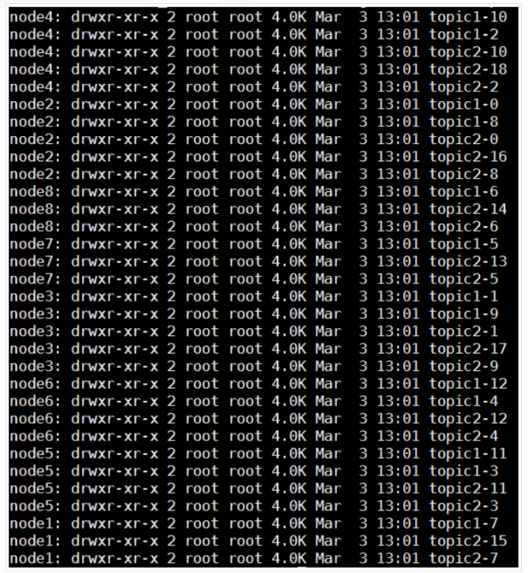

# kafka

### 1.Kafka起源

​         Apache Kafka最初由[LinkedIn](https://en.wikipedia.org/wiki/LinkedIn)开发，随后于2011年初开源，2012年10月23日从[Apache Incubator](https://en.wikipedia.org/wiki/Apache_Incubator)毕业。2014年，曾在LinkedIn从事Kafka工作的Jun Rao，Jay Kreps和Neha Narkhede创建了一家名为Confluent的新公司，专注于Kafka开发，根据Quora在2014年发表的一篇文章，Kreps选择以作者[Franz Kafka](https://en.wikipedia.org/wiki/Franz_Kafka)的名字命名该软件，因为该软件是“*a system optimized for writing*”，他喜欢Kafka的作品。（*[引自维基百科Apache Kafka](https://en.wikipedia.org/wiki/Apache_Kafka)*）

### 2.Kafka概述

#### 2.1.Kafka简介

​              Apache Kafka是由LinkedIn采用[Scala](https://en.wikipedia.org/wiki/Scala_(programming_language))和[Java](https://en.wikipedia.org/wiki/Java_(programming_language))开发的开源流处理软件（[open-source](https://en.wikipedia.org/wiki/Open-source_software) [stream-processing](https://en.wikipedia.org/wiki/Stream_processing)）平台，并捐赠给了[Apache Software Foundation](https://en.wikipedia.org/wiki/Apache_Software_Foundation)。该项目旨在提供统一的、高吞吐量、低延迟的平台来处理实时数据流。Kafka可以通过Kafka Connect连接到外部系统，并提供了Kafka Streams（一种Java流处理[库](https://en.wikipedia.org/wiki/Library_(computing))）。Kafka使用经过优化的二进制TCP协议，并使用抽象“message set”将消息分组以减少网络开销并且可以支撑更大的网络数据包，从而使Kafka可以将突发的随机消息写入流转换为线性写入。

#### **2.2.Kafka的特性**

​       Kafka是一种分布式的，基于发布/订阅的消息系统，主要特性如下：

### 3.Kafka架构设计

#### 3.1.kafka设计思想

​              一个最基本的架构是生产者发布一个消息到Kafka的一个Topic ，该Topic的消息存放于的Broker中，消费者订阅这个Topic，然后从Broker中消费消息，下面这个图可以更直观的描述这个场景：

.svg)

​     上图所示的架构分为三部分：Producer、Kafka Broker、Consumer Group，它们分别运行在不同的节点，下面概括介绍一下Kafka一些设计思想：

   **Consumer Group：**Kafka是按消费组来消费消息，一个消费组下面的所有机器可以组成一个Consumer Group，每条消息只能被该Consumer Group一个Consumer消费，不同Consumer Group可以消费同一条消息**。**

   **消息状态：**在Kafka中，消息是否被消费的状态保存在Consumer中，Broker不会关心消息是否被消费或被谁消费，Consumer会记录一个offset值（指向partition中下一条将要被消费的消息位置），如果offset被错误设置可能导致同一条消息被多次消费或者消息丢失。

   **消息持久化：**Kafka会把消息持久化到本地文件系统中，并且具有极高的性能。

   **批量发送：**Kafka支持以消息集合为单位进行批量发送，以提高效率。

   **Push-and-Pull：**Kafka中的Producer和Consumer采用的是Push-and-Pull模式，即Producer向Broker Push消息，Consumer从Broker Pull消息。

   **分区机制（Partition）：**Kafka的Broker端支持消息分区，Producer可以决定把消息发到哪个Partition，在一个Partition中消息的顺序就是Producer发送消息的顺序，一个Topic中的Partition数是可配置的，Partition是Kafka高吞吐量的重要保证。

#### 3.2.Kafka系统架构

.svg)

**kafka拓扑结构**

​       如上图所示，一个典型的Kafka集群中包含若干Producer、Broker、Consumer Group以及一个Zookeeper集群。Kafka通过Zookeeper管理Broker集群，Producer使用Push模式将消息发送到Broker，Consumer Group使用Pull模式从Broker订阅并消费消息。***（**本文均以Kafka0.9.X版本做阐述，后面不再重复说明）*

- **Broker**

- 一个Kafka集群中的一台服务器就是一个Broker，Broker可以水平无限扩展，同一个Topic中的消息可以分布在多个Broker中。

- **Consumer** : Consumer通过向 Broker 发出一个“Fetch”请求来获取它想要消费的消息，Consumer 的每个请求都在消息文件中指定了对应的 offset，并接收从该位置开始的一大块数据。因此，Consumer 对于该位置的控制就显得极为重要，并且可以在需要的时候通过回退到某个位置再次消费对应的数据。

- **Producer** 

- 将客户端生产的Message发送到Broker中的Partition Leader节点，Producer可以通过配置保证写入的消息不会丢失， Producer同时支持消息异步发送、批量发送。

- **Push vs. Pull**

  作为一个消息系统，Kafka遵循了传统的方式，选择由 Producer 向 Broker Push 消息并由 Consumer 从 Broker Pull 消息。一些 logging-centric system，比如 Facebook 的[ Scribe ](https://github.com/facebookarchive/scribe)和 Cloudera 的[ Flume ](http://flume.apache.org/)，采用Push模式。事实上，Push模式和Pull模式各有优劣。Push 模式很难适应消费速率不同的消费者，因为消息发送速率是由Broker决定的。Push 模式的目标是尽可能以最快速度传递消息，但是这样很容易造成 Consumer 来不及处理消息，典型的表现就是拒绝服务以及网络拥塞。而Pull 模式则可以根据Consumer 的消费能力以适当的速率消费消息。对于Kafka而言，Pull 模式更合适。Pull 模式可简化 Broker 的设计，Consumer可自主控制消费消息的速率，同时Consumer可以自己控制消费方式（即可批量消费也可逐条消费），同时还能选择不同的提交方式从而实现不同的传输语义。

- **Topic & Partition**

  Topic在逻辑上可以被认为是一个Queue，Kafka中每条消息都必须指定一个Topic，一个Topic中的消息可以分布在集群中的多个Broker中，Consumer根据订阅的Topic到对应的Broker上去拉取消息。为了提升整个集群的吞吐量，物理上一个Topic可以分成多个Partition，每个Partition在磁盘上对应一个文件夹，该文件夹下存放了这个Partition的所有消息文件和索引文件。假设有topic1和topic2两个Topic，且分别有13个和19个分区，则整个集群会生成32个文件夹，如下图所示：

  

 每个消息文件都是一个**log entry**序列，其格式如下图所示：

.svg)

 上图左侧的“RECORD”部分就是Kafka的消息格式，一条完整的消息包含RECORD、offset以及message size。其中offset用来标识它在Partition中的偏移量，这个offset是逻辑值，而非实际物理偏移值，message size表示消息的大小。与消息对应的还有消息集的概念，消息集中包含一条或者多条消息，消息集不仅是存储于磁盘以及在网络上传输（Produce & Fetch）的基本形式，而且是kafka中压缩的基本单元，详细结构参考上图右侧。下面来具体描述一下消息（RECORD）格式中的各个字段，从crc32开始算起，各个字段的解释如下：

 **crc32（4B）：**crc32校验值，校验范围为magic至value之间。

 **magic（1B）：**消息格式版本号，0.9.X版本的magic值为0。

 **attributes（1B）：**消息的属性，总共占1个字节，低3位表示压缩类型：0表示NONE、1表示GZIP、2表示SNAPPY、3表示LZ4，其余位保留。

 **key length（4B）**：表示消息的key的长度。如果为-1，则表示没有设置key，即key=null。

 **key：**可选，如果没有key则无此字段。

 **value length（4B）**：实际消息体的长度。如果为-1，则表示消息为空。

 **value：**消息体，可以为空。 

 消息发送到Broker后，每条消息都被顺序写该Partition所对应的文件中，因此效率非常高，这是Kafka高吞吐率的一个很重要的保证。

.svg)

这里要注意，因为Kafka读取消息的时间复杂度为O(1)，即与文件大小无关，所以这里删除过期文件与提高Kafka性能无关。另外，Kafka会为每一个Consumer Group保留一些metadata信息（当前消费的消息的位置，即offset）。这个offset由Consumer控制，Consumer会在消费完一条消息后递增该offset。当然，Consumer也可将offset设成一个较小的值，重新消费一些消息。因为offet由Consumer控制，所以Kafka Broker是无状态的，它不需要标记消息是否被消费过，也不需要通过Broker去保证同一个Consumer Group只有一个Consumer能消费某一条消息，因此也就不需要锁机制，从而保证了Kafka的高吞吐率。 下图中，Consumer 1、2分属于不同的Consumer Group，Consumer 2的offset =4，Consumer 1的offset=3，这表明Consumer Group 1中的Consumer下次会从offset = 3 的message读取， Consumer Group 2中的Consumer下次会从offset = 4 的message读取。注意 这里并没有说是Consumer 1 下次会从offset = 3 的message读取，原因是Consumer 1可能会退出Group ，然后Consumer Group 1 进行重新分配分区。

.svg)

#### 3.3 消息发送

​      Producer其主要功能是负责向Broker发送消息，工作原理可以如下图所示：

.svg)

​         Producer发送消息到Broker时，会根据Paritition机制选择将消息存储到哪一个Partition。如果Partition机制设置合理，所有消息可以均匀分布到不同的Partition里，这样就实现了负载均衡。如果一个Topic对应一个文件，那这个文件所在的机器I/O将会成为这个Topic的性能瓶颈，而有了Partition后，不同的消息可以并行写入不同的Partition中，极大的提高了吞吐率。所谓的Partition机制也就是Poducer消息partitioning策略，具体有以下几种策略：

​     **轮询策略**

1. 轮询策略是Kafka Java客户端生产者的默认策略
2. 轮询策略的负载均衡表现非常优秀，总能保证消息最大限度地被平均分配到所有分区上，默认情况下它是最合理的分区策略，轮询策略的消息分布如下图所示：

.svg)

​       **随机策略**

​              1.随机策略默认从**Partition**列表中随机选择一个，随机策略的消息分布大致如下图所示：

.svg)

​           **按消息键保序策略**

1. Kafka允许为每条消息定义**消息键**，简称为Key

2. Key可以是一个有明确业务含义的字符串：客户代码、部门编号、业务ID、用来表征消息的元数据等

3. 一旦消息被定义了Key，可以保证**同一个Key的所有消息都进入到相同的分区里**，由于每个分区下的消息处理都是**顺序**的，所以这个策略被称为**按消息键保序策略。**

   .svg)

​        **自定义策略**

1. 自定义的分区策略，需要显式地配置生产者端的参数**partitioner.class**
2. 实现接口：**org.apache.kafka.clients.producer.Partitioner**

#### 3.4 消息消费

​       Kafka消费者API封装了对集群中一系列Broker的访问，可以透明的消费Topic中的数据，消费者在消费的过程中需要记录自己消费了多少数据。很多消息引擎都把这部分信息维护在服务器端，这样做的好处是实现简单，但会有三个主要的问题：1. Broker从此变成有状态的，会影响伸缩性；2. 需要引入应答机制（acknowledgement）增加了系统复杂度。3. 由于要保存很多Consumer的offset信息，必然引入复杂的数据结构，造成资源浪费。而Kafka的方案是每个Consumer Group保存自己的位移信息，那么只需要简单的一个整数表示位置就够了，同时可以引入Checkpoint机制定期持久化，简化了应答机制的实现。

​       老版本的位移是提交到Zookeeper中的，但是Zookeeper其实并不适合进行大批量的读写操作，尤其是写操作。从0.9版本开始kafka提供了另一种解决方案：增加了__consumer_offsets这个Topic，将offset信息写入这个Topic，这样Consumer不需要依赖Zookeeper。

.svg)

Kafka的Consumer Group是采用Pull的方式来消费消息，那么每个Consumer该消费那个Partition的消息则需要一套严格的机制来保证，而且Partition是可以水平无限扩展的，随着Partition的扩展Consumer消费的Partition也会重新分配，这里就涉及到kafka的消息消费分配策略，在Kafka内部存在两种默认的分区分配策略：Range和RoundRobin，当以下事件发生时，Kafka将会进行一次分区分配：

- 同一个Consumer Group内新增消费者
- 消费者离开当前所属的Group，包括Shuts Down或Crashes
- 订阅的主题新增Partition

**Range策略**

​       本文假设我们有个名为 T1 的主题，其包含了5个分区，然后我们有两个消费者（C1，C2）来消费这5个分区里面的数据，而且C1的 num.streams = 2，C2 的 num.streams = 1（这里num.streams指的是消费者的消费线程个数）。Range策略是对每个主题而言的，首先对同一个主题里面的分区按照序号进行排序，并对消费者按照顺序进行排序。在我们的例子里面，排完序的分区将会是0, 1, 2, 3, 4,；消费者线程排完序将会是C1-0, C1-1, C2-0。然后将partitions的个数除以消费者线程的总数来决定每个消费者线程消费几个分区。如果除不尽，那么前面几个消费者线程将会多消费一个分区。在我们的例子里面，我们有5个分区，3个消费者线程， 5 / 3 = 1，而且除不尽，那么消费者线程 C1-0 、C1-1将会多消费一个分区，所以最后分区分配的结果看起来是这样的：C1-0 将消费 0,  1分区，C1-1 将消费 2, 3 分区，C2-0 将消费4分区。具体消费示意图如下所示：

.svg)

如果我们增加了Partition，从之前的5个分区现在变成了6个分区，那么最后分区分配的结果看起来是这样的：C1-0 将消费0,1分区，C1-1 将消费2,3分区，C2-0 将消费 4,5分区，最终消费如下所示：

.svg)

**RoundRobin策略**

​         使用RoundRobin策略有两个前提条件必须满足：

​	• 同一个Consumer Group里面的所有消费者的num.streams必须相等；

​	• 每个消费者订阅的主题必须相同。

​       所以这里假设前面提到的2个消费者的num.streams = 2。RoundRobin策略的工作原理：将所有主题的分区组成 TopicAndPartition 列表，然后对 TopicAndPartition 列表按照 hashCode 进行排序。在我们的例子里面，假如按照 hashCode 排序完的topic-partitions组依次为T1-5, T1-3, T1-0, T1-2, T1-1, T1-4, ，我们的消费者线程排序为C1-0, C1-1, C2-0, C2-1，最后分区分配的结果为：C1-0 将消费T1-5,T1-1； 分区C1-1 将消费 T1-3, T1-4,分区；C2-0 将消费 T1-0, 分区；C2-1 将消费 T1-2, 分区；消费示意如下图：

.svg)

#### 3.5.Kafka消息可靠性

​       Kafka的高可靠性的保障来源于其健壮的副本（replication）策略即partition的replication机制，Kafka将为每个partition提供多个replication，同时将replication分布到整个集群的其它Broker中，具体的replication数量可以通过参数设置，这里的replication会选举一个Leader节点，其它节点为Follower节点，消息发送全部发送到Leader然后再通过同步算法同步到Follower节点中，当其中有replication不能工作会重新进行选举，即使部分Broker宕机仍然能保证整个集群高可用，消息不丢失。

.svg)

与此同时，当producer向leader发送数据时，可以通过request.required.acks参数来设置数据可靠性的级别：

-  1：这意味着producer在replication中的leader已成功收到的数据并得到确认后发送下一条message，如果leader宕机了，则会丢失数据。

-  0：这意味着producer无需等待来自broker的确认而继续发送下一批消息，这种情况下数据传输效率最高，但是数据可靠性确是最低的。
-  -1：producer需要等待replication中的所有follower都确认接收到数据后才算一次发送完成，可靠性最高，但是这样也不能保证数据不丢失，比如当replication中只有leader时，这样就变成了acks=1的情况。       

###  4.业界Kafka实际应用场景

####       **4.1异步通信**

​        消息中间件在异步通信中用的最多，很多业务流程中，如果所有步骤都同步进行可能会导致核心流程耗时非常长，更重要的是所有步骤都同步进行一旦非核心步骤失败会导致核心流程整体失败，因此在很多业务流程中Kafka就充当了异步通信角色。下图是某系统中Kafka作为异步通信的典型使用，该系统中新增数据需要写入多个缓存集群，如果同步写入会导致调用方请求耗时较长，因此这里在新增数据的同时发送一条异步消息，通过消息去异步更新缓存。

.svg)

#### **4.2日志同步**

​       大规模分布式系统中的机器非常多而且分散在不同机房中，分布式系统带来的一个明显问题就是业务日志的查看、追踪和分析等行为变得十分困难，对于集群规模在百台以上的系统，查询线上日志很恐怖。为了应对这种场景统一日志系统应运而生，日志数据都是海量数据，通常为了不给系统带来额外负担一般会采用异步上报，这里Kafka以其高吞吐量在日志处理中得到了很好的应用。

.svg)

#### 4.3实时计算

​         随着据量的增加，离线的计算会越来越慢，难以满足用户在某些场景下的实时性要求，因此很多解决方案中引入了实时计算。很多时候，即使是海量数据，我们也希望即时去查看一些数据指标，实时流计算应运而生。实时流计算有两个特点，一个是实时，随时可以看数据；另一个是流。下面是Kafka在某个典型实时计算系统中的应用。

.svg)
